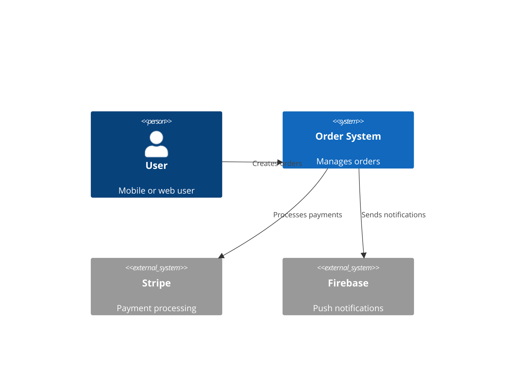
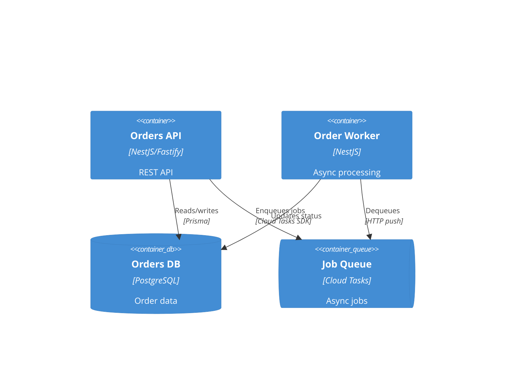

# Architecture Design

> **When to use**: Designing a new service, system integration, or major feature that touches multiple components — before implementation starts
> **Time estimate**: 2–4 hours for a focused feature; 1–2 days for a new service
> **Prerequisites**: Feature spec or requirements in `docs/specs/`; tech stack constraints known

## Overview

Architecture design using the `architecture-design` skill, `architect` agent, and `/design-architecture` command. Produces C4 diagrams, API contracts, sequence diagrams, ADRs, and a deployment topology before any code is written. Uses `plan-challenger` agent for adversarial review.

---

## Iron Law (from `skills/architecture-design/SKILL.md`)

> **DEFINE API CONTRACTS BEFORE WRITING IMPLEMENTATION CODE**
> Contracts that change after implementation cause cascading rewrites across consumers.

---

## Phases

### Phase 1 — Load Skill and Scope the Design

**Skill**: Load `architecture-design` (`.claude/skills/architecture-design/SKILL.md`)

**Scope questions before any diagrams**:
1. What problem does this solve? (user story or business outcome)
2. What are the system boundaries? (what's in scope, what's out)
3. What are the non-functional requirements? (latency, throughput, availability, data retention)
4. What existing systems does this touch?
5. What constraints are non-negotiable? (must use existing DB, must be async, etc.)
6. What's the expected data volume and growth rate?

**Surface assumptions**:
```
ASSUMPTIONS I'M MAKING:
1. [assumption about scale]
2. [assumption about existing infrastructure]
3. [assumption about team ownership]
→ Correct me now or I'll proceed with these.
```

---

### Phase 2 — `/design-architecture` Command

**Command**: `/design-architecture [description of what to build]`
**Source**: `commands/design-architecture.md`
**Agent**: `architect`

**What the architect agent produces**:
1. **C4 Context diagram** — system in its environment (users, external systems)
2. **C4 Container diagram** — major technical components (services, DBs, queues)
3. **Sequence diagram** — key flows (happy path + error paths)
4. **API contract** — endpoint signatures before implementation
5. **Deployment topology** — where things run (Cloud Run, Cloud SQL, Firebase)
6. **ADR** — the key technology decision with alternatives considered

**Dispatch architect agent**:
```
Dispatch: architect agent
Prompt: Design the architecture for [feature]. Constraints: [list]. Existing systems: [list].
Produce: C4 diagrams (Mermaid), API contract (OpenAPI 3.1 snippets), sequence diagram, ADR.
```

---

### Phase 3 — C4 Diagrams

**Level 1 — Context** (who uses the system, what external systems):


**Level 2 — Container** (services, databases, queues):


---

### Phase 4 — API Contract First

**Define contracts before implementation** (from architecture-design Iron Law):

```yaml
# From OpenAPI spec — defined before any controller is written
POST /orders:
  summary: Create order
  requestBody:
    required: true
    content:
      application/json:
        schema:
          type: object
          required: [itemId, quantity]
          properties:
            itemId: { type: string }
            quantity: { type: integer, minimum: 1 }
  responses:
    '201':
      content:
        application/json:
          schema:
            type: object
            properties:
              id: { type: string, format: uuid }
              status: { type: string, enum: [PENDING, CONFIRMED, CANCELLED] }
              createdAt: { type: string, format: date-time }
    '400':
      description: Validation error
    '409':
      description: Duplicate order
```

**Consumer contracts first**: If other services or the frontend will call this API, share the draft contract with them before implementing. Misaligned contracts cause expensive rewrites.

---

### Phase 5 — ADR Creation

**Skill**: `architecture-decision-records`
**File**: `docs/adr/<N>-<title>.md`

**When to write an ADR** (from `adr-creation.md` workflow):
- Choosing between two viable technical options
- Deciding on a communication pattern (sync vs async)
- Selecting a database or storage solution
- Making a technology choice that's hard to reverse

**Template**:
```markdown
# ADR-[N]: [Decision Title]
Date: [YYYY-MM-DD]
Status: Proposed | Accepted | Superseded by ADR-[N]

## Context
[Why is this decision needed? What forces are at play?]

## Decision
[What was decided? In one clear sentence.]

## Alternatives Considered
| Option | Pros | Cons |
|--------|------|------|
| [A] | ... | ... |
| [B] | ... | ... |
| [Chosen] | ... | ... |

## Consequences
- Positive: [what this enables]
- Negative: [what this makes harder]
- Neutral: [what changes but isn't better or worse]
```

---

### Phase 6 — Adversarial Review with `plan-challenger`

**Agent**: `plan-challenger` (read-only)

**Dispatch after design is complete**:
```
Review the architecture in docs/plans/[date]-[feature].md
Check for: wrong assumptions, missing cases, security gaps, architectural anti-patterns, complexity creep
```

**What plan-challenger attacks** (from agent description):
1. Assumptions (what is taken as given without evidence)
2. Missing Cases (failure modes, edge cases not addressed)
3. Security (threats not modeled)
4. Architecture (coupling, scaling bottlenecks, single points of failure)
5. Complexity Creep (is this more complex than it needs to be?)

**Gate**: Address all CRITICAL findings from plan-challenger before starting implementation.

---

### Phase 7 — Save Approved Plan

**Save to**: `docs/plans/YYYY-MM-DD-<feature>.md`

**Structure**:
```markdown
# Plan: [Feature Name]
Date: [YYYY-MM-DD]
Status: Approved
Approved by: [developer name]

## Architecture Summary
[2–3 sentence overview]

## Components
[List with owner service for each]

## API Contracts
[Links to OpenAPI snippets or inline]

## ADRs
[Links to docs/adr/ files]

## Implementation Order
[Phases with dependencies]

## Gates
[Quality gates before declaring done]
```

---

## Quick Reference

| Phase | Action | Agent | Output |
|-------|--------|-------|--------|
| 1 — Scope | Questions + assumptions | Manual | Written scope |
| 2 — Design | `/design-architecture` | `architect` agent | C4 + seq + contract |
| 3 — Diagrams | Mermaid C4 diagrams | `mermaid-expert` agent | `docs/diagrams/` |
| 4 — Contract | OpenAPI first | Manual | API spec file |
| 5 — ADR | Document key decision | `architecture-decision-records` skill | `docs/adr/` |
| 6 — Review | Adversarial challenge | `plan-challenger` agent | Findings |
| 7 — Save | Approved plan doc | Manual | `docs/plans/` |

---

## Common Pitfalls

- **Architecture without constraints** — "use microservices" without knowing team size, latency budget, or operational capacity leads to over-engineering
- **No adversarial review** — architectures that pass only their own designers' review often have obvious-in-hindsight flaws
- **API contract after implementation** — the contract hardened by implementation is the wrong starting point for consumers
- **Missing failure modes** — happy path architecture is incomplete; model what happens when each dependency is unavailable
- **No ADR** — decisions made verbally are forgotten; write them down

## Related Workflows

- [`ideation-to-spec.md`](ideation-to-spec.md) — spec before architecture
- [`plan-review.md`](plan-review.md) — structured review of the resulting plan
- [`adr-creation.md`](adr-creation.md) — detailed ADR workflow
- [`database-schema-design.md`](database-schema-design.md) — schema design follows architecture
