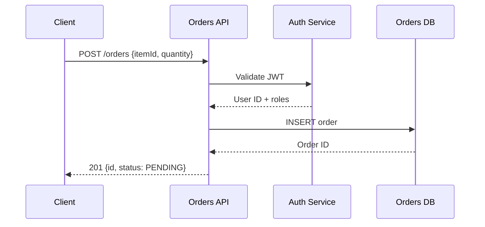

# Documentation Generation

> **When to use**: Generating API docs (OpenAPI), release notes (CHANGELOG), architecture diagrams, or onboarding guides from code
> **Time estimate**: 30 min for a single doc type; 2 hours for a full documentation pass
> **Prerequisites**: Code is implemented and tests pass; project-specific templates must be read first

## Overview

Documentation generation using four specialized skills: `documentation-generation` (Iron Law: read templates first), `openapi-spec-generation` (API contracts), `changelog-generator` (release notes from conventional commits), and `mermaid-expert` agent (architecture diagrams). Output goes to `docs/` directories.

---

## Iron Law (from `skills/documentation-generation/SKILL.md`)

> **NO DOC GENERATION WITHOUT READING THE PROJECT-SPECIFIC TEMPLATES FIRST**
> Generic documentation is worse than no documentation — it sets wrong expectations.

Check for templates before generating anything:
```bash
ls docs/templates/           # Project templates
ls .claude/skills/*/reference/  # Skill reference docs
```

---

## Document Types and Commands

| Document Type | Command / Skill | Output Location |
|--------------|----------------|----------------|
| OpenAPI spec | `openapi-spec-generation` skill | `docs/api/<service>-openapi.yaml` |
| Release notes / CHANGELOG | `changelog-generator` skill | `CHANGELOG.md` |
| Architecture diagram | `mermaid-expert` agent | `docs/diagrams/<feature>-flow.md` |
| API onboarding guide | `tutorial-engineer` agent | `docs/guides/<topic>.md` |
| Database ERD | `/design-database` command | `docs/database/<feature>-erd.md` |
| ADR | `architecture-decision-records` skill | `docs/adr/<N>-<title>.md` |

---

## Phases

### Phase 1 — OpenAPI Spec Generation

**Skill**: `openapi-spec-generation`

**When**: After implementing a new API endpoint or before sharing API with consumers

**Steps**:
1. Load `openapi-spec-generation` skill
2. Read existing spec if present: `docs/api/<service>-openapi.yaml`
3. For each new endpoint, document:
   - Method + path
   - Request body schema (Pydantic/DTO → JSON Schema)
   - Response schemas (200, 201, 400, 401, 403, 404, 422, 500)
   - Authentication requirements
   - Example request/response

**Output format** (OpenAPI 3.1):
```yaml
openapi: 3.1.0
info:
  title: Orders API
  version: 1.0.0

paths:
  /orders:
    post:
      summary: Create an order
      security:
        - bearerAuth: []
      requestBody:
        required: true
        content:
          application/json:
            schema:
              $ref: '#/components/schemas/CreateOrderRequest'
            example:
              itemId: "item-1"
              quantity: 2
      responses:
        '201':
          description: Order created
          content:
            application/json:
              schema:
                $ref: '#/components/schemas/OrderResponse'
        '400':
          $ref: '#/components/responses/ValidationError'
        '401':
          $ref: '#/components/responses/Unauthorized'

components:
  schemas:
    CreateOrderRequest:
      type: object
      required: [itemId, quantity]
      properties:
        itemId:
          type: string
          minLength: 1
        quantity:
          type: integer
          minimum: 1
          maximum: 1000
```

**Validate the spec**:
```bash
npx @redocly/cli lint docs/api/orders-openapi.yaml
```

---

### Phase 2 — Changelog Generation

**Skill**: `changelog-generator`

**Input**: Git history with conventional commits
**Output**: `CHANGELOG.md` or App Store/Play Store release notes

**Step 1 — Extract commits since last release**:
```bash
git log v1.2.0..HEAD --oneline --format="%s"
# feat: add order search by status
# fix: return 409 instead of 500 on duplicate order
# feat: add pagination to order list
# chore: update dependencies
```

**Step 2 — Categorize**:
- `feat:` → New Features section
- `fix:` → Bug Fixes section
- `perf:` → Performance Improvements section
- `security:` → Security Updates section
- `breaking:` → Breaking Changes (headline, always first)
- `chore:`, `docs:`, `refactor:` → omit from user-facing notes

**Output format**:
```markdown
## [1.3.0] — 2026-03-13

### New Features
- Add order search by status
- Add pagination to order list

### Bug Fixes
- Return 409 Conflict (not 500) for duplicate orders

### Security Updates
- Upgrade dependencies to resolve CVE-2026-XXXXX
```

**App Store / Play Store release notes** (from `changelog-generator` skill):
```
What's new in 1.3.0:
• Search orders by status
• Browse orders with pagination
• Fixed order duplication error
```

---

### Phase 3 — Architecture Diagrams

**Agent**: `mermaid-expert`

**When**: After implementing a new service, flow, or integration
**Trigger from `blackbox-policy.md`**: If files modified this session map to `docs/diagrams/`, update the diagram.

**Diagram types**:

| Type | Use case | Mermaid syntax |
|------|---------|----------------|
| Sequence diagram | API request flow, auth flow | `sequenceDiagram` |
| Flowchart | Business logic, decision trees | `flowchart TD` |
| ERD | Database schema | `erDiagram` |
| C4 Container | Service architecture | `C4Container` |
| State diagram | Lifecycle states | `stateDiagram-v2` |

**Example: Order creation sequence**:


**File naming**: `docs/diagrams/<feature>-flow.md`

**Validation** (from `code-standards.md`):
- Validate Mermaid syntax mentally before writing
- Escape special characters in node labels
- Always provide text description as fallback below diagram

---

### Phase 4 — Tutorial / Onboarding Guide

**Agent**: `tutorial-engineer`

**When**: New feature needs consumer documentation; onboarding a new developer

**Structure** (from `tutorial-engineer` agent):
1. What you'll learn
2. Prerequisites
3. Step-by-step with code examples
4. Common errors and fixes
5. Next steps

**Output**: `docs/guides/<topic>.md`

---

### Phase 5 — Verify Documentation Quality

Before declaring documentation complete:

- [ ] All code examples are tested (copy-paste runnable)
- [ ] OpenAPI spec validates (`@redocly/cli lint`)
- [ ] Mermaid diagrams render without syntax errors
- [ ] Changelog entries are accurate (cross-reference git log)
- [ ] No references to internal implementation details the consumer doesn't need
- [ ] Version numbers are correct

---

## Quick Reference

| Doc Type | Skill / Agent | Command | Output |
|----------|--------------|---------|--------|
| OpenAPI spec | `openapi-spec-generation` | Manual generation | `docs/api/` |
| CHANGELOG | `changelog-generator` | Parse git log | `CHANGELOG.md` |
| Architecture diagram | `mermaid-expert` agent | Generate from description | `docs/diagrams/` |
| Tutorial / guide | `tutorial-engineer` agent | Generate from code | `docs/guides/` |
| Database ERD | `database-designer` agent | `/design-database` | `docs/database/` |
| ADR | `architecture-decision-records` skill | Manual | `docs/adr/` |

---

## Common Pitfalls

- **Generating docs from memory** — always read the actual code before generating docs; APIs change
- **No example in OpenAPI** — specs without examples are harder to consume; always include `example:` fields
- **Diagram not updated after code change** — `blackbox-policy.md` requires diagram updates when covered code changes
- **Generic release notes** — "bug fixes and improvements" tells users nothing; be specific
- **Including implementation details** — API docs describe the contract, not the internal implementation

## Related Workflows

- [`new-skill-creation.md`](new-skill-creation.md) — creating skill documentation
- [`adr-creation.md`](adr-creation.md) — documenting architectural decisions
- [`database-schema-design.md`](database-schema-design.md) — ERD generation as part of schema design
